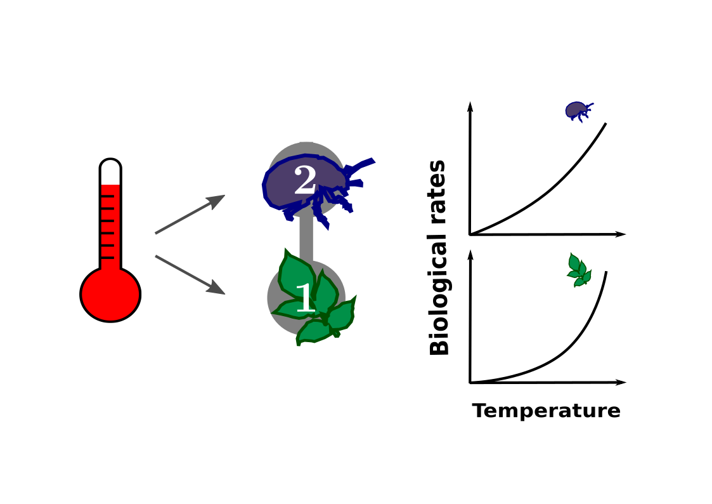

```{r setup, echo = F}
knitr::opts_chunk$set(
  comment = "#",
  #cache = TRUE,
  collapse = TRUE,
  warning = FALSE,
  message = FALSE,
  fig.width = 7,
  fig.height = 5.25,
  fig.align = 'center',
  fig.retina = 3
)

# base plot layout
mypar = list(mar = c(3,3,0.5,0.5), mgp = c(1.5, 0.3, 0), tck = -.008)

# xaringan Extra
xaringanExtra::use_xaringan_extra(c("tile_view", "animate_css", "tachyons"))
xaringanExtra::use_extra_styles(
  hover_code_line = TRUE,         #<<
  mute_unhighlighted_code = TRUE  #<<
)
xaringanExtra::use_editable(expires = 1)
xaringanExtra::use_panelset()
```
class: middle, title-slide

<!-- top logo (comment to remove or edit on `conf/css/style.css:23`) -->
<div class="lab-logo"></div>
<!-- <div class="uni-logo"></div> -->

# Effects of temperature on species and their trophic interactions

<hr width="65%" align="left" size="0.3" color="orange"></hr>

## A cross-scales perspective

### Azenor Bideault, .small[PhD candidate <br> Dominique Gravel and Michel Loreau]

<br><br>
[<i class="fa fa-github fa-lg" style="color:#e7e8e2"></i> Azenor/talk_seminar2UdeS](https://github.com/Azenor/talk_seminar2UdeS)

[<i class="fa fa-twitter fa-lg" style="color:#e7e8e2"></i> @Azenor_Bideault](https://twitter.com/Azenor_Bideault)

---
# How do communities differ from one pole to another ?

.center[Spot the differences!]
.pull-left[

]
.pull-right[

]

--

- Species identity
- Species richness
- Interactions
- ...

---
# Communities vary across space and time

.pull-left[
]

---
# Communities vary across space and time

.pull-left[
]

.pull-right[
- Identity of species
]

---
# Communities vary across space and time

.pull-left[
]

.pull-right[
- Identity of species
- Number of species
]

---
# Communities vary across space and time

.pull-left[
]

.pull-right[
- Identity of species
- Number of species
- Biomass
]

---
# Communities vary across space and time

.pull-left[
]

.pull-right[
- Identity of species
- Number of species
- Biomass
- Interactions

]

---
# Communities vary across space and time

.pull-left[
]

.pull-right[
- Identity of species
- Number of species
- Biomass
- Interactions
- Interaction strength

]

---
# Communities vary across space and time

.pull-left[
]

.pull-right[
- Identity of species
- Number of species
- Biomass
- Interactions
- Interaction strength
- Stability]

--
.center[How and why ?]

---
# Food webs vary across space and time

.pull-left[


<br>
.center[Trophic interactions]]

.pull-right[
- Identity of species
- Number of species
- Biomass
- Interactions
- Interaction strength
- Stability]

---

# Trophic interactions

.center[Are at the core of ecological systems]


.center[Trophic cascade : Sea otters indirectly enhance kelp abundance by consuming herbivorous sea urchins]

.cite[Estes et al. [2011] Science]

---
class: middle, center, inverse

# What determines food webs structure and dynamics ?
<hr width="100%" align="left" size="0.3" color="orange"></hr>

---
# Back to the x differences

.center[What else is different ?]

.pull-left[

]
.pull-right[

]

--

.center[
Environmental drivers :
- Temperature
- Precipitation]

---
# Temperature

.pull-left[
A major environmental gradient

]

--

.pull-right[
Global warming

]

<br>
.center[**What are the effects of temperature ?**]

---
# Effects of temperature

<br>
.center[
From the individual to the community

]

---
# Effects of temperature

.center[
On populations
]


---
# Effects of temperature

.center[
On their interactions
]

---
# Effects of temperature

.center[
On the structure and dynamics of consumer-resource systems
]


---
# Effects of temperature

.center[
On food webs


- Structure
- Dynamics
- Stability]

---
# Lack of consensus

- Hard to disentangle the various effects of temperature
- How do they propagate ?
- Effect of the temperature gradient $\neq$ effect of warming?

Most studies explore :
- One particular ecological system
- One process at a time

with different
- experimental design
- study system
- theoretical framework
- model assumptions

<br>
.center[**No synthetic understanding yet**]

---
class: middle, center, inverse

# How does temperature affect species and their interactions ?
## A cross-scales perspective
<hr width="100%" align="left" size="0.3" color="orange"></hr>

---
# A cross-scales perspective

.center[
]

---
# A cross-scale perspective

.center[
]

- Thermal mismatches in biological rates determine trophic
control and biomass distribution under warming

---
# A cross-scale perspective

.center[
]

- Thermal mismatches in biological rates determine trophic
control and biomass distribution under warming
- Effects of temperature on fish food webs at the global scale

.center[*Using theory*]

---
# A cross-scale perspective

.center[
]

- Thermal mismatches in biological rates determine trophic
control and biomass distribution under warming
- Effects of temperature on fish food webs at the global scale
- Short-term thermal adaptation of growth rates in wild bacteria
strains

.center[*Using theory and experiments*]

---
# A cross-scale perspective

.center[
]

- **Thermal mismatches in biological rates determine trophic
control and biomass distribution under warming**
- **Effects of temperature on fish food webs at the global scale**
- Short-term thermal adaptation of growth rates in wild bacteria
strains

.center[*Theoretical approaches*]

---
class: middle, center, inverse
# Thermal mismatches in biological rates determine trophic control and biomass distribution under warming
## A cross-ecosystem comparison

---
# Food chain structural properties

.center[
Biomass distribution
]

---
# Food chain structural properties

.center[
Biomass distribution
]

---
# Food chain dynamical features

.center[
Trophic control

]

---
# Food chain dynamical features

.center[
Trophic control

]


---
# Temperature effects

.center[
**On food chain structure and dynamics**

]

---
class: middle, center, inverse
# Method

---
# Method

.center[**How to (try to) answer big questions ?**

One approach : using **small** models !]

<br>

Theoretical approach
- simulate consumer-resource interactions
- general overview (go beyond system particularities)
- toward a synthetic understanding

Combined to data
- for various systems

---
# Theoretical framework

.center[Dynamics of consumer-resource systems]

$$
\begin{align}
\dfrac{dB_i}{dt} &= \textrm{production} - \textrm{predation losses} - \textrm{internal losses} \\
\dfrac{dB_i}{dt} &= g_iB_i + \epsilon A_{ji}B_iB_j - A_{ik}B_iB_k - q_iB_i - D_iB_i^2
\end{align}
$$

* B<sub>i</sub> biomass of species *i*
* g<sub>i</sub> growth rate
* ϵ conversion efficiency
* A<sub>ji</sub> attack rate
* q<sub>i</sub> metabolic rate
* D<sub>i</sub> self-regulation

<br>
.center[Explore some properties of the system]

---
# A quick note on self-regulation
.font80[An important but not well known parameter]

<br>
.center[**Intraspecific density dependent regulation**
<br>
A population’s growth rate is negatively affected by its own population
density]
<br>
Examples :
- territoriality
- infanticide
- intra-guild predation
- competition for light

<br>
.center[**Important to match stability levels observed in nature**]

---
# Theoretical framework

Synthetic parameters describing food chain properties

.center[]

κ denotes how much biomass is gained by consumers per unit biomass lost by resources

.cite[Barbier & Loreau [2019]]

---
# Theoretical framework
Synthetic parameters describing food chain properties

.center[]

λ describes the feedback of a trophic level on itself through its predators

.cite[Barbier & Loreau [2019]]

---
# Theoretical framework
Temperature dependence

.center[]

---
# Theoretical framework
Temperature dependence

.center[]

---
# Theoretical framework
Temperature dependence of biological rates

.pull-left[.center[]]

.pull-right[
<br><br>

$\huge b_i = b_{0_i}e^{-E_i/kT}$

<br><br><br>

* b<sub>0</sub>, k constants
* T temperature
* **E activation energy**
]

<br><br>
.center[The activation energy defines the rate's thermal sensitivity]

---
# Theoretical framework
Temperature dependence of the synthetic parameters

Synthetic parameters :
$κ = \dfrac{ϵD_1}{D_2}$, $λ = \dfrac{ϵA_{21}}{D_1D_2}$

--
.pull-left1[
Their activation energies :
<br><br>
$E_κ = E_ϵ + E_{D_1} - E_{D_2}$
<br><br>
$E_\lambda =  E_ϵ + 2(E_A-E_{D_2}) + E_{D_2} - E_{D_1}$]

.pull-right1[ <br>
Mismatches between biological rates]

---
# Database of activation energies

.center[]

.pull-left[
* Various species (ectotherm)
* Taxonomic groups
* Habitat
* Diet]

<br>
.cite[Dell et al [2011], Burnside et al [2014], Fussman et al [2014]]

---
# Database of activation energies

.center[]

<br>
No information available regarding the temperature dependence of self regulation hence
.center[D ~ g, A, q]

---
# Effects of temperature on biomass structure and trophic control in consumer-resource interactions

<br><br>
* Temperature dependence of λ and κ
  - Aquatic vs terrestrial organisms
  - Across taxonomic groups
* Shift in λ and κ for herbivores-primary producers at the global scale

---
class: inverse, center, middle
# Results

---
# Thermal dependence of λ and κ

<br><br>
.center[]

---
# Thermal dependence of λ and κ across taxonomic groups

<br>
.center[]

---
# Thermal dependence of λ and κ across taxonomic groups

<br>
.center[]

.pull-right1[**Mismatches between biological rates**]

---
# Herbivory at the global scale

<br>
.center[]

---
# To conclude

- Mechanistic understanding
  - Importance of 3 parameters and their mismatches in temperature dependence
- Different effects of warming between aquatic and terrestrial communities
  - more top-down control in aquatic systems
  - top-heavier pyramids in aquatic and terrestrial systems
- Variation between taxonomic groups
  - could explain the observed variety of responses
- Estimation for herbivory at the global scale coherent with other studies
  - Predictions

---
# To conclude


But...

- Lack of data
  - Self-regulation
  - Biomass conversion efficiency
  - Full thermal response
- Consumer-resource interactions

---
# Upscaling to food webs at the global scale

.center[
]

---
class: inverse, center, middle
# Effects of temperature on fish food webs at the global scale

---
# Effects of temperature on food webs

<br><br>
.center[]

- Warming
- Temperature gradient

Do they affect community structure and dynamics in a similar way ?

---
# Important gradients across latitudes

.center[]

---
# Food webs properties

<br><br>
.center[

Effects of the temperature gradient and warming : compare community and species dynamics]

---
class: inverse, middle, center

# Method

---
# Fish communities at large scale

<br>
.center[
Trophic interactions]

---
# Data

.center[]
<br><br>
.cite[Albouy et al [2019], Irigoien et al [2014]]

---
# Theoretical approach

<br>
.center[**Modelling communities to infer their structural and dynamical properties**]

Lotka-Volterra system

\begin{align}
  \frac{dB_i}{dt} = g_iB_i + \sum_j \epsilon M_{ij} B_iB_j-\sum_k M_{ki} B_iB_k - D_iB_i^2
\end{align}

<br>

- B biomass
- M<sub>ij</sub> interaction matrix
- g<sub>i</sub> net growth rate
- D<sub>i</sub> self regulation
- *ϵ* conversion efficiency

.center[**How to parameterize the model?**]

---
# Temperature and body-mass dependence of biological rates

.pull-left[]

.pull-right[

$\large b_i = m_i^\beta b_0e^{-E/kT}$

<br>

* m body mass
* *β* exponent
* b<sub>0</sub>, k constants
* T temperature
* E activation energy]

<br>

.center[**Growth, metabolic and attack rate**]

---
# Theoretical approach

<br>
.center[**Modelling communities to infer their structural and dynamical properties**]

Lotka-Volterra system

\begin{align}
  \frac{dB_i}{dt} = g_i + \sum_j \epsilon M_{ij} B_j-\sum_k M_{ki} B_k - D_iB_i
\end{align}

<br>

- **B biomass**
- M interaction matrix
- g net growth rate
- **D self regulation**
- *ϵ* conversion efficiency

.center[Self-regulation is completely unknown...<br>
Biomass can be inferred from allometric relationship]

---
# Estimation of species biomass

.center[Abundance law

]
.cite[Hatton et al [2019]]

---
# Method to estimate self-regulation

<br>
.center[From available parameters and]
<br>
\begin{align}
  \frac{dB_i}{dt} = g_iB_i + \sum_j \epsilon M_{ij} B_iB_j-\sum_k M_{ki} B_iB_k - D_iB_i^2
\end{align}

<br><br>
.center[
- allow coexistence
- biomass follows allometric laws]

---
# Method to estimate self-regulation

<br>
.center[A little trick to estimate self-regulation


You'll have to believe me (or not) for today...]

---
# Measures of community dynamics

<br>
.center[


**Median λ**]

---
# Measures of community dynamics

<br>
.center[


**Sum species biomass**]

---
# Measures of species dynamics

<br>
.center[


**Relative change in species biomass**]

---
# Measures of community dynamics

<br>
.center[


**Variability :  temporal biomass variance in response to stochastic pertubations (community average)**]

---
# Measures of community dynamics

<br>
.center[


**Collectivity :  importance of indirect interactions (collectivity = 1, a change in species abundance affect other species far in the network)**]

---
class: inverse, middle, center
# Results

---
# Community properties at large scale

.center[Trophic control
]

---
# Community properties according to the number of species

<br>
.center[

Effect of the number of species on λ and collectivity]

---
# Residual properties according to temperature

<br>
.center[
.font70[(while controlling for the number of species)]

<br>
The temperature gradient alone does not seem to strongly affect community properties (except collectivity)

<br>
**But what about warming ?**]

---
# Effect of warming on community properties

.center[Relative change with warming

]

<br>
.center[Warming affects collectivity and variability but not other community properties

Interactive effect of warming and the temperature gradient]

---
# Effect of warming on species biomass

.center[If warming does not affect some properties of the community as a whole, does it affect single species in the community ?]

--
<br>
.center[Relative change in species biomass with warming for each trophic level

]

---
# To conclude

- Latitudinal variation mostly driven by number of species
- λ decreases and collectivity increases with the number of species
  - Latitudinal variation in trophic control
- Temperature gradient and warming affects collectivity, warming affects variability, but not significantly other community properties

<br><br>
.center[**Warming seems to affect individual species more significantly than communities as an entity**

Especially species from trophic levels 2 and 3]

---
# To conclude

<br>
Limitations :

- Limited data available
- No variation in activation energies (but same taxonomic group)
- Model assumptions and parameters

.center[The model is right but it might be wrong]

---
class: inverse, middle, center
# General conclusion

---
# To conclude - First part

.center[]

.center[**3 fundamental biological rates and their mismatches**]

---
# To conclude - First part

.center[]

.center[**General trend : more top-down control in aquatic systems and top-heavier biomass distribution in terrestrial and aquatic ones**]

---
# To conclude - Second part

.center[

Temperature effects seem to vary from one scale to another !]

---
# To conclude - Second part

- Latitudinal gradient mostly driven by number of species
- Community properties seem robust to warming
- But individual species much less !
  - Which could explain why strong effects are observed at lower scales
  - Warming effect on λ for a pair of species $\neq$ λ at the community level

<br>
.center[**Theoretical exploration of the direct effect of warming to better understand mechanisms**]

--

Of course in nature ... things can be different !
- Warming has interactive effects
- Habitat loss
- Fishing
- Increase in human populations
- Pollution
- ...

---
class: inverse

.pull-left1[
<br>

.font180[**So this is not an excuse to take the plane too often** ;)]

<br><br><br><br><br>

**Special thanks to**

- You for listening
- My supervisors Dominique and Michel
- Matthieu, Jeff and Ben
- Lab mates in Sherbrooke and Moulis
- Will for the (beautiful right?) template
]

.pull-right1[
<br>

]
