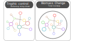
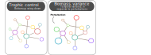

```{r setup, echo = F}
knitr::opts_chunk$set(
  comment = "#",
  #cache = TRUE,
  collapse = TRUE,
  warning = FALSE,
  message = FALSE,
  fig.width = 7,
  fig.height = 5.25,
  fig.align = 'center',
  fig.retina = 3
)

# base plot layout
mypar = list(mar = c(3,3,0.5,0.5), mgp = c(1.5, 0.3, 0), tck = -.008)

# xaringan Extra
xaringanExtra::use_xaringan_extra(c("tile_view", "animate_css", "tachyons"))
xaringanExtra::use_extra_styles(
  hover_code_line = TRUE,         #<<
  mute_unhighlighted_code = TRUE  #<<
)
xaringanExtra::use_editable(expires = 1)
xaringanExtra::use_panelset()
```
class: middle, title-slide

<!-- top logo (comment to remove or edit on `conf/css/style.css:23`) -->
<div class="lab-logo"></div>
<!-- <div class="uni-logo"></div> -->

# Latitudinal variation and warming impacts in fish food web dynamics

<hr width="65%" align="left" size="0.3" color="orange"></hr>
## Econet 2021

### Azenor Bideault, Matthieu Barbier, Arnaud Sentis, <br> Michel Loreau & Dominique Gravel

<br><br>
[<i class="fa fa-github fa-lg" style="color:#e7e8e2"></i> Azenor/talk_Econet2021](https://github.com/Azenor/talk_Econet2021)

[<i class="fa fa-twitter fa-lg" style="color:#e7e8e2"></i> @Azenor_Bideault](https://twitter.com/Azenor_Bideault)

---
# How do communities differ from one pole to another ?

.center[Spot the differences!]
.pull-left[

]
.pull-right[

]

--

- Species identity
- Species richness
- Interactions
- ...

---
# Food webs vary across space and time

.pull-left[
]

---
# Food webs vary across space and time

.pull-left[
]

.pull-right[
- Identity of species
]

---
# Food webs vary across space and time

.pull-left[
]

.pull-right[
- Identity of species
- Number of species
]

---
# Food webs vary across space and time

.pull-left[
]

.pull-right[
- Identity of species
- Number of species
- Biomass
]

---
# Food webs vary across space and time

.pull-left[
]

.pull-right[
- Identity of species
- Number of species
- Biomass
- Interactions

]

---
# Food webs vary across space and time

.pull-left[
]

.pull-right[
- Identity of species
- Number of species
- Biomass
- Interactions
- Interaction strength

]

---
# Food webs vary across space and time

.pull-left[
]

.pull-right[
- Identity of species
- Number of species
- Biomass
- Interactions
- Interaction strength
- Stability]

---
# Trophic interactions

.center[Are at the core of ecological systems]


.center[Trophic cascade : Sea otters indirectly enhance kelp abundance by consuming herbivorous sea urchins]

.cite[Estes et al. [2011]]

---
class: middle, center, inverse

# What determines food webs structure and dynamics ?
<hr width="100%" align="left" size="0.3" color="orange"></hr>

---
# Temperature

.pull-left[
A major environmental gradient

]

--

.pull-right[
Global warming

]

<br>
.center[**What are the effects of temperature ?**]

---
# Effects of temperature

<br>
.center[
From the individual to the community

]

---
# Direct effect of temperature

.center[
On populations
]


---
# Direct effect of temperature

.center[
On their interactions
]

---
# Effect of temperature

.center[
On the dynamics of food webs
]

---
# Other variables

.center[


Disentangle the direct effects of temperature on food webs dynamics]

---
# Impacts on food webs dynamics

Food webs properties

<br>
.center[

Effects of the temperature gradient and warming : compare community and species dynamics]

---
# Effects of temperature on food webs

<br><br>
.center[]

- Temperature gradient
  - Direct effect of temperature
  - Other variables : connectance, species richness, body mass, total biomass
- Warming

---
# Lack of consensus

- Hard to disentangle the various effects of temperature
- How do they propagate from the populations to the community ?
- Effect of the temperature gradient $\neq$ effect of warming?

Most studies explore :
- One particular ecological system
- One process at a time

with different
- experimental design
- study system
- theoretical framework
- model assumptions

<br>
.center[**No synthetic understanding yet**]

---
class: middle, center, inverse
# Method

---
# Fish communities at large scale

<br>
.center[
Trophic interactions]

---
# Data

.center[]
<br><br>
.cite[Albouy et al [2019], Irigoien et al [2014]]

---
# Theoretical approach

<br>
.center[**Modelling communities to infer their structural and dynamical properties**]

Lotka-Volterra system

\begin{align}
  \dfrac{dB_i}{dt} &= \textrm{production} - \textrm{predation losses} - \textrm{internal losses} \\
  \frac{dB_i}{dt} &= g_iB_i + \sum_j \epsilon M_{ij} B_iB_j-\sum_k M_{ki} B_iB_k - D_iB_i^2
\end{align}

<br>

- B biomass
- M<sub>ij</sub> interaction matrix
- g<sub>i</sub> net growth rate
- D<sub>i</sub> self regulation
- *ϵ* conversion efficiency

---
# A quick note on self-regulation
.font80[An important but not well known parameter]

<br>
.center[**Intraspecific density dependent regulation**
<br>
A population’s growth rate is negatively affected by its own population
density]
<br>
Examples :
- territoriality
- infanticide
- intra-guild predation
- competition for light

<br>
.center[**Important to match stability levels observed in nature**]

---
# Temperature and body-mass dependence of biological rates

.pull-left[
<br>]

.pull-right[

$\large b_i = m_i^\beta b_0e^{-E/kT}$

<br>

* m body mass
* *β* exponent
* b<sub>0</sub>, k constants
* T temperature
* E activation energy]

<br>

.center[**Growth and attack rate**]
.cite[Savage et al [2004], Li et al [2018]]


---
# Theoretical approach

<br>
.center[**Modelling communities to infer their structural and dynamical properties**]

Lotka-Volterra system

\begin{align}
  \frac{dB_i}{dt} = g_i + \sum_j \epsilon M_{ij} B_j-\sum_k M_{ki} B_k - D_iB_i
\end{align}

<br>

- **B biomass**
- M interaction matrix
- g net growth rate
- **D self regulation**
- *ϵ* conversion efficiency

---
# Estimation of species biomass

.center[Self-regulation is completely unknown...<br>
Biomass can be inferred from allometric relationship]

--
.center[
]
.cite[Hatton et al [2019]]

---
# Method to estimate self-regulation

<br>
\begin{align}
  \frac{dB_i}{dt} = g_iB_i + \sum_j \epsilon M_{ij} B_iB_j-\sum_k M_{ki} B_iB_k - D_iB_i^2
\end{align}

<br><br>
.center[
- using estimations of biological rates and biomass
- allow coexistence
- equilibrium]

<br><br>

.center[**Simulate the dynamics of communities and measure some dynamical properties**]

---
# Measures of community dynamical properties

<br>
.center[


**Trophic control**]

---
# Food chain dynamical features

.center[
Trophic control

]

---
# Food chain dynamical features

.center[
Trophic control

]

---
# Measures of community dynamics

<br>
.center[


**Sum species biomass**]

---
# Measures of species dynamics

<br>
.center[


**Relative change in species biomass**]

---
# Measures of community dynamics

<br>
.center[


**Variability :  temporal biomass variance in response to stochastic pertubations (community average)**]

---
# Variability

.center[
<br>
\begin{align}
  \mathcal{V} = tr(C)
\end{align}

where $C$ is the covariance matrix (solution of the Lyapunov equation $AC+CA^T = \mathbb I$ with $A$ the Jacobian matrix for the dynamics at equilibrium)

**It defines how species abundances in the community respond on average to randomly adding or removing individuals**]

.cite[Arnoldi et al [2019]]

---
# Measures of community dynamics

<br>
.center[


**Collectivity :  importance of indirect interactions (collectivity = 1, a change in species abundance affect other species far in the network)**]

---
# Collectivity

<br>
.center[
\begin{align}
  \phi = \rho(M_{ij}) = \max_i|\lambda_i(M)|
\end{align}

the spectral radius of the interaction matrix normalized by its diagonal whose elements are $D_i$, $M_{ij} = A_{ij}/D_i$, and $\lambda_i(M)$ is the ith eigenvalue of matrix $M$.

**Quantifies the number and length of indirect interactions relative to direct interactions (collectivity = 1, a change in species abundance affect other species far in the network)**]

---
# Measures of community dynamics along the latitudinal gradient

**Identify the drivers of latitudinal variation**

- Measure metrics for each community
- Compute the relative contributions of the variables
  - Temperature
  - Connectance
  - Species richness
  - Body mass
  - Total biomass

---
# Simulate warming

.center[

- Direct effect of warming on species biological rates
- Compute the relative change in community metrics

\begin{align}
  \Delta(x) = \textrm{log}_{10}(x_{warm}) - \textrm{log}_{10}(x) \approx (x_{warm} - x)/x
\end{align}
]

---
class: inverse, middle, center
# Results

---
# Community properties at large scale

.center[]

---
# Community properties according to the number of species

.center[

**Less top down control, higher variability and collectivity at low latitudes**]

---
# Community properties according to the number of species

.center[]

---
# Community properties according to the number of species

.center[]

---
# Community properties according to the number of species

.center[]

---
# Community properties according to the number of species

.center[]

---
# Community properties according to the number of species

.center[]

---
# Effect of warming on community properties

<br>
.center[]

---
# Effect of warming on biomass

<br>
.center[]

---
# To conclude

.center[**There is latitudinal variation in community dynamics**]

- Trophic control decreases with the number of species and the connectance and increases with body mass
- Variability decreases with body mass and temperature
- Collectivity increases with temperature and species richness

---
# To conclude

<br><br>
.center[**Warming seems to affect individual species more significantly than communities as an entity**]

- Increase in top-down control and collectivity and decrease in variability
- Variation in species biomass, especially species from trophic levels 2 and 3]

---
# To conclude

<br>
Limitations :

- Limited data available
- No variation in activation energies (but same taxonomic group)
- Model assumptions and parameters

.center[Better picture of the drivers of latitudinal variation in community dynamics, which is important to understand the effects of climate change]

---
class: inverse

.pull-left1[
<br>

.font180[blabla]

<br><br><br><br><br>

**Special thanks to**

- You for listening
- My supervisors Dominique and Michel
- Matthieu, Jeff and Ben
- Lab mates in Sherbrooke and Moulis
- Will for the nice template
]

.pull-right1[
<br>

]
